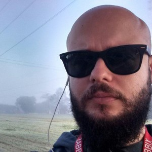

# Diego Neves

Linux Sysadmin desde 2007 migrando para DevOps/SRE, Especialista em Redes de Computadores e Bacharel em Sistemas de Informação. Já organizou eventos e coordenou grupos de usuários no Nordeste de Minas Gerais, além de palestrar em eventos como a Latinoware, EMSL, FISL e FGSL. Sempre buscando resolver os problemas da melhor forma possível, ou seja, usando Software Livre